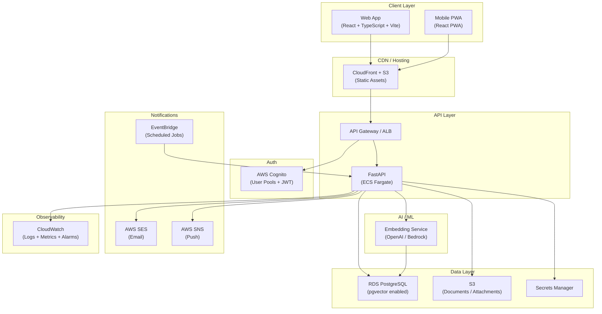
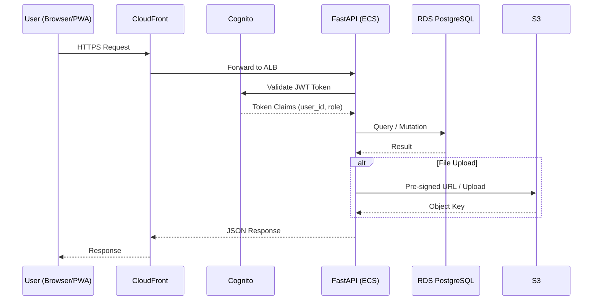
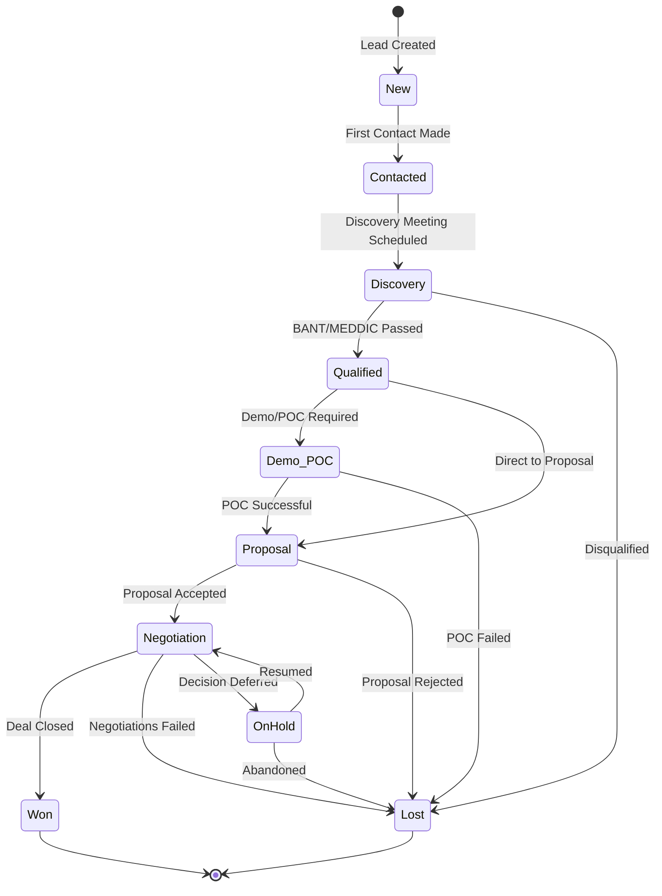
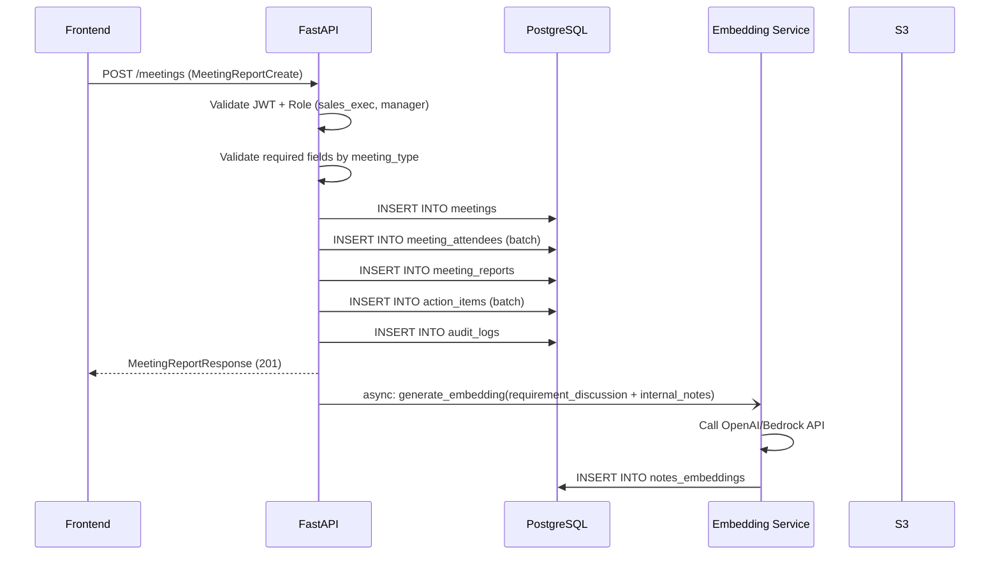
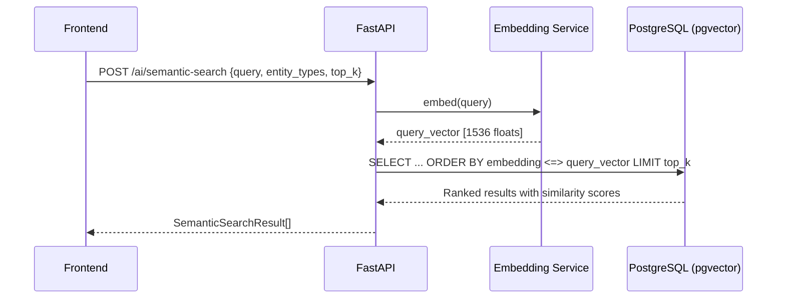
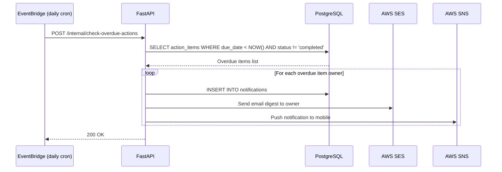
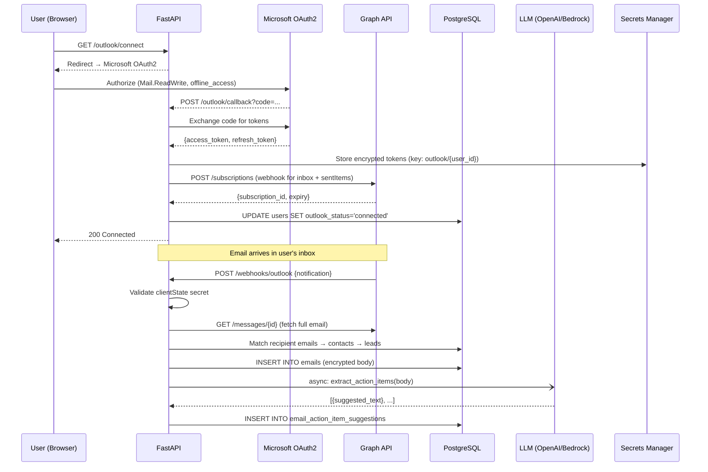

# Design Document: Sales Lead Management Platform

## Overview

The Sales Lead Management Platform is a centralized, full-stack application for capturing, tracking, qualifying, and progressing sales leads from first interaction to deal closure. It serves field sales executives, sales managers, pre-sales engineers, and administrators through a React/TypeScript web dashboard and a Progressive Web App (PWA) for mobile use.

The platform digitizes meeting report templates (Commercial/Industrial and Defence/Aerospace), enforces a structured lead lifecycle, tracks action items with owners and due dates, and layers AI-powered semantic search and recommendations via PostgreSQL with pgvector. The backend is FastAPI on AWS ECS Fargate, with RDS PostgreSQL, S3, Cognito for auth, and CloudWatch for observability.

The system is designed for phased delivery: Phase 1 delivers auth, users, accounts, contacts, leads, and a basic dashboard; subsequent phases add meeting reports, opportunity pipeline, AI intelligence, mobile PWA enhancements, and production hardening.


## Architecture

### High-Level System Architecture




### Request Flow




### Lead Lifecycle Flow




---

## Components and Interfaces

### Component 1: Authentication & Authorization

**Purpose**: Authenticate users via AWS Cognito JWT tokens; enforce role-based access control (RBAC) on every API endpoint.

**Roles**: `admin`, `sales_head`, `sales_manager`, `sales_executive`, `pre_sales`, `delivery_team`, `viewer`

**Interface** (FastAPI middleware):

```python
class TokenClaims(BaseModel):
    sub: str          # Cognito user ID
    email: str
    role: str         # custom:role attribute
    team_id: str | None

class AuthContext(BaseModel):
    user_id: UUID
    email: str
    role: str
    team_id: UUID | None

def get_current_user(token: str = Depends(oauth2_scheme)) -> AuthContext:
    """Validate Cognito JWT, extract claims, return AuthContext."""
    ...

def require_role(*allowed_roles: str):
    """Dependency factory that restricts endpoint to specific roles."""
    ...
```

**Responsibilities**:
- Validate JWT expiry and signature against Cognito JWKS
- Extract `custom:role` and `sub` from token claims
- Inject `AuthContext` into every route handler via FastAPI Depends
- Raise `HTTP 403` when role is not permitted

---

### Component 2: Lead Management

**Purpose**: Full CRUD and status-transition lifecycle management for sales leads.

**Interface**:

```python
class LeadStatus(str, Enum):
    NEW = "new"
    CONTACTED = "contacted"
    DISCOVERY = "discovery"
    QUALIFIED = "qualified"
    DEMO_POC = "demo_poc"
    PROPOSAL = "proposal"
    NEGOTIATION = "negotiation"
    WON = "won"
    LOST = "lost"
    ON_HOLD = "on_hold"

class LeadCreate(BaseModel):
    lead_name: str
    account_id: UUID
    lead_source: str | None
    owner_id: UUID
    priority: str
    estimated_value: Decimal | None
    expected_close_date: date | None

class LeadUpdate(BaseModel):
    lead_name: str | None
    priority: str | None
    estimated_value: Decimal | None
    expected_close_date: date | None
    owner_id: UUID | None

class LeadStatusTransition(BaseModel):
    status: LeadStatus
    reason: str | None

class LeadResponse(BaseModel):
    id: UUID
    lead_name: str
    account_id: UUID
    account_name: str
    owner_id: UUID
    owner_name: str
    status: LeadStatus
    priority: str
    estimated_value: Decimal | None
    expected_close_date: date | None
    created_at: datetime
    updated_at: datetime
```

**Responsibilities**:
- Validate status transitions against allowed state machine edges
- Automatically create an audit log entry on status change
- Trigger embedding generation when lead notes are saved
- Enforce owner assignment rules per role


---

### Component 3: Meeting Report Management

**Purpose**: Capture structured meeting reports using two template types — Commercial/Industrial Automation and Defence/Aerospace.

**Interface**:

```python
class MeetingType(str, Enum):
    COMMERCIAL_INDUSTRIAL = "commercial_industrial"
    DEFENCE_AEROSPACE = "defence_aerospace"

class AttendeeInput(BaseModel):
    name: str
    designation: str
    role_in_decision: str   # e.g., "Decision Maker", "Influencer", "User"

class MeetingReportCreate(BaseModel):
    lead_id: UUID
    meeting_date: date
    meeting_time: time
    location_mode: str
    meeting_type: MeetingType
    objective: str
    prepared_by: UUID
    client_company: str
    industry_vertical: str | None           # Commercial field
    department_directorate: str | None      # Defence field
    plant_facility_location: str | None     # Commercial field
    programme_project_reference: str | None # Defence field
    security_classification: str | None     # Defence field
    attendees: list[AttendeeInput]
    requirement_discussion: str
    competitive_landscape: str | None
    client_feedback_concerns: str | None
    deal_qualification_notes: str | None
    pipeline_status: str | None
    action_items: list[ActionItemCreate]
    internal_notes: str | None

class MeetingReportResponse(BaseModel):
    id: UUID
    lead_id: UUID
    meeting_type: MeetingType
    meeting_date: date
    attendees: list[AttendeeResponse]
    action_items: list[ActionItemResponse]
    embedding_id: UUID | None
    created_at: datetime
```

**Responsibilities**:
- Validate that defence-specific fields are present when type is `defence_aerospace`
- After save, enqueue embedding generation for `requirement_discussion` + `internal_notes`
- Associate all action items with this meeting and the parent lead
- Support PDF export of the meeting report

---

### Component 4: Opportunity / Pipeline Management

**Purpose**: Track deal progression, pipeline stage, probability, and deal qualification fields.

**Interface**:

```python
class OpportunityStage(str, Enum):
    DISCOVERY = "discovery"
    QUALIFIED = "qualified"
    DEMO_POC = "demo_poc"
    PROPOSAL = "proposal"
    NEGOTIATION = "negotiation"
    CLOSED_WON = "closed_won"
    CLOSED_LOST = "closed_lost"

class OpportunityCreate(BaseModel):
    lead_id: UUID
    opportunity_name: str
    stage: OpportunityStage
    probability: int                   # 0-100
    estimated_deal_value: Decimal
    budget_confirmed: bool
    decision_maker_met: bool
    poc_required: bool
    internal_approval_needed: bool
    expected_order_timeline: str | None

class OpportunityPatch(BaseModel):
    stage: OpportunityStage | None
    probability: int | None
    estimated_deal_value: Decimal | None
    budget_confirmed: bool | None
    decision_maker_met: bool | None
```

**Responsibilities**:
- Validate probability is 0–100
- Sync opportunity stage with parent lead status on `CLOSED_WON` / `CLOSED_LOST`
- Aggregate pipeline value by stage for forecast view
- Trigger audit log on stage transitions


---

### Component 5: Action Items & Follow-Up Tracking

**Purpose**: Track every follow-up action from meetings with owner assignment, due dates, and overdue alerts.

**Interface**:

```python
class ActionItemStatus(str, Enum):
    OPEN = "open"
    IN_PROGRESS = "in_progress"
    COMPLETED = "completed"
    CANCELLED = "cancelled"

class ActionItemCreate(BaseModel):
    action_item: str
    owner_id: UUID
    due_date: date
    priority: str
    meeting_id: UUID | None
    lead_id: UUID

class ActionItemResponse(BaseModel):
    id: UUID
    action_item: str
    owner_id: UUID
    owner_name: str
    due_date: date
    status: ActionItemStatus
    priority: str
    is_overdue: bool
    lead_id: UUID
    meeting_id: UUID | None
    created_at: datetime
```

**Responsibilities**:
- Compute `is_overdue` dynamically: `due_date < today AND status != completed`
- EventBridge daily job queries overdue items and sends SES/SNS notifications to owners
- Action items linked to both a meeting and a lead for traceability

---

### Component 6: AI / Semantic Search

**Purpose**: Generate embeddings for meeting notes and lead data; support semantic search, similar lead discovery, duplicate detection, and next-action recommendations.

**Interface**:

```python
class EmbedRequest(BaseModel):
    entity_type: str   # "meeting_report" | "lead_note" | "action_item"
    entity_id: UUID
    content: str

class SemanticSearchRequest(BaseModel):
    query: str
    entity_types: list[str]
    top_k: int = 10
    filters: dict | None

class SemanticSearchResult(BaseModel):
    entity_type: str
    entity_id: UUID
    content_snippet: str
    similarity_score: float
    metadata: dict

class SimilarLeadsRequest(BaseModel):
    lead_id: UUID
    top_k: int = 5

class SummarizeMeetingRequest(BaseModel):
    meeting_id: UUID

class RecommendNextActionRequest(BaseModel):
    lead_id: UUID
```

**Responsibilities**:
- Call embedding model (OpenAI `text-embedding-3-small` or AWS Bedrock Titan) to generate 1536-dim vectors
- Store vectors in `notes_embeddings` table using pgvector `VECTOR(1536)` column
- Use `<=>` cosine distance operator for similarity queries
- Summarization calls LLM with meeting transcript as context
- Duplicate detection runs cosine similarity at lead creation time, alerts if score > 0.92


---

## Data Models

### Core Database Schema

```sql
-- Users and Roles
CREATE TABLE roles (
    id UUID PRIMARY KEY DEFAULT gen_random_uuid(),
    name VARCHAR(50) NOT NULL UNIQUE,   -- admin, sales_head, sales_manager, etc.
    permissions JSONB NOT NULL DEFAULT '{}'
);

CREATE TABLE teams (
    id UUID PRIMARY KEY DEFAULT gen_random_uuid(),
    name VARCHAR(100) NOT NULL,
    manager_id UUID,
    created_at TIMESTAMP DEFAULT NOW()
);

CREATE TABLE users (
    id UUID PRIMARY KEY DEFAULT gen_random_uuid(),
    cognito_sub VARCHAR(255) NOT NULL UNIQUE,
    email VARCHAR(255) NOT NULL UNIQUE,
    full_name VARCHAR(255) NOT NULL,
    role_id UUID NOT NULL REFERENCES roles(id),
    team_id UUID REFERENCES teams(id),
    is_active BOOLEAN DEFAULT TRUE,
    created_at TIMESTAMP DEFAULT NOW(),
    updated_at TIMESTAMP DEFAULT NOW()
);

-- Accounts and Contacts
CREATE TABLE accounts (
    id UUID PRIMARY KEY DEFAULT gen_random_uuid(),
    name VARCHAR(255) NOT NULL,
    industry VARCHAR(100),
    account_status VARCHAR(50),         -- prospect, active, inactive
    location TEXT,
    website VARCHAR(255),
    created_at TIMESTAMP DEFAULT NOW(),
    updated_at TIMESTAMP DEFAULT NOW()
);

CREATE TABLE contacts (
    id UUID PRIMARY KEY DEFAULT gen_random_uuid(),
    account_id UUID NOT NULL REFERENCES accounts(id) ON DELETE CASCADE,
    full_name VARCHAR(255) NOT NULL,
    designation VARCHAR(150),
    email VARCHAR(255),
    phone VARCHAR(50),
    role_in_decision VARCHAR(100),      -- Decision Maker, Influencer, User, Gatekeeper
    is_primary BOOLEAN DEFAULT FALSE,
    created_at TIMESTAMP DEFAULT NOW()
);
```


```sql
-- Leads
CREATE TABLE leads (
    id UUID PRIMARY KEY DEFAULT gen_random_uuid(),
    account_id UUID REFERENCES accounts(id),
    lead_name VARCHAR(255) NOT NULL,
    lead_source VARCHAR(100),           -- referral, inbound, outbound, event, etc.
    owner_id UUID NOT NULL REFERENCES users(id),
    status VARCHAR(50) NOT NULL DEFAULT 'new',
    priority VARCHAR(50) DEFAULT 'medium',
    estimated_value NUMERIC(14,2),
    expected_close_date DATE,
    created_at TIMESTAMP DEFAULT NOW(),
    updated_at TIMESTAMP DEFAULT NOW()
);

CREATE INDEX idx_leads_status ON leads(status);
CREATE INDEX idx_leads_owner_id ON leads(owner_id);
CREATE INDEX idx_leads_account_id ON leads(account_id);

-- Opportunities
CREATE TABLE opportunities (
    id UUID PRIMARY KEY DEFAULT gen_random_uuid(),
    lead_id UUID NOT NULL REFERENCES leads(id) ON DELETE CASCADE,
    opportunity_name VARCHAR(255) NOT NULL,
    stage VARCHAR(50) NOT NULL DEFAULT 'discovery',
    probability INTEGER CHECK (probability BETWEEN 0 AND 100),
    estimated_deal_value NUMERIC(14,2),
    budget_confirmed BOOLEAN DEFAULT FALSE,
    decision_maker_met BOOLEAN DEFAULT FALSE,
    poc_required BOOLEAN DEFAULT FALSE,
    internal_approval_needed BOOLEAN DEFAULT FALSE,
    expected_order_timeline VARCHAR(100),
    created_at TIMESTAMP DEFAULT NOW(),
    updated_at TIMESTAMP DEFAULT NOW()
);

-- Meetings
CREATE TABLE meetings (
    id UUID PRIMARY KEY DEFAULT gen_random_uuid(),
    lead_id UUID NOT NULL REFERENCES leads(id) ON DELETE CASCADE,
    meeting_date DATE NOT NULL,
    meeting_time TIME,
    location_mode VARCHAR(100),         -- on-site, virtual, phone
    meeting_type VARCHAR(100) NOT NULL, -- commercial_industrial | defence_aerospace
    objective TEXT,
    prepared_by UUID NOT NULL REFERENCES users(id),
    client_company VARCHAR(255),
    industry_vertical VARCHAR(100),
    department_directorate VARCHAR(150),
    plant_facility_location TEXT,
    programme_project_reference VARCHAR(200),
    security_classification VARCHAR(50),
    created_at TIMESTAMP DEFAULT NOW()
);

CREATE TABLE meeting_attendees (
    id UUID PRIMARY KEY DEFAULT gen_random_uuid(),
    meeting_id UUID NOT NULL REFERENCES meetings(id) ON DELETE CASCADE,
    name VARCHAR(255) NOT NULL,
    designation VARCHAR(150),
    role_in_decision VARCHAR(100),
    contact_id UUID REFERENCES contacts(id)
);
```


```sql
-- Meeting Reports (detailed content)
CREATE TABLE meeting_reports (
    id UUID PRIMARY KEY DEFAULT gen_random_uuid(),
    meeting_id UUID NOT NULL UNIQUE REFERENCES meetings(id) ON DELETE CASCADE,
    requirement_discussion TEXT,
    competitive_landscape TEXT,
    client_feedback_concerns TEXT,
    deal_qualification_notes TEXT,
    pipeline_status VARCHAR(100),
    internal_notes TEXT,
    roi_notes TEXT,
    compliance_notes TEXT,
    created_at TIMESTAMP DEFAULT NOW(),
    updated_at TIMESTAMP DEFAULT NOW()
);

-- Action Items
CREATE TABLE action_items (
    id UUID PRIMARY KEY DEFAULT gen_random_uuid(),
    meeting_id UUID REFERENCES meetings(id) ON DELETE SET NULL,
    lead_id UUID NOT NULL REFERENCES leads(id) ON DELETE CASCADE,
    action_item TEXT NOT NULL,
    owner_id UUID NOT NULL REFERENCES users(id),
    due_date DATE NOT NULL,
    status VARCHAR(50) NOT NULL DEFAULT 'open',
    priority VARCHAR(50) DEFAULT 'medium',
    completed_at TIMESTAMP,
    created_at TIMESTAMP DEFAULT NOW()
);

CREATE INDEX idx_action_items_owner ON action_items(owner_id);
CREATE INDEX idx_action_items_due_date ON action_items(due_date);
CREATE INDEX idx_action_items_status ON action_items(status);

-- Competitive Intelligence
CREATE TABLE competitors (
    id UUID PRIMARY KEY DEFAULT gen_random_uuid(),
    lead_id UUID NOT NULL REFERENCES leads(id) ON DELETE CASCADE,
    competitor_name VARCHAR(255) NOT NULL,
    strengths TEXT,
    weaknesses TEXT,
    our_differentiators TEXT,
    created_at TIMESTAMP DEFAULT NOW()
);

-- Documents and Notes
CREATE TABLE documents (
    id UUID PRIMARY KEY DEFAULT gen_random_uuid(),
    entity_type VARCHAR(50) NOT NULL, -- lead, meeting, account
    entity_id UUID NOT NULL,
    file_name VARCHAR(255) NOT NULL,
    s3_key VARCHAR(500) NOT NULL,
    mime_type VARCHAR(100),
    uploaded_by UUID REFERENCES users(id),
    created_at TIMESTAMP DEFAULT NOW()
);

CREATE TABLE notes (
    id UUID PRIMARY KEY DEFAULT gen_random_uuid(),
    entity_type VARCHAR(50) NOT NULL,
    entity_id UUID NOT NULL,
    content TEXT NOT NULL,
    created_by UUID NOT NULL REFERENCES users(id),
    created_at TIMESTAMP DEFAULT NOW()
);

-- AI Embeddings
CREATE EXTENSION IF NOT EXISTS vector;

CREATE TABLE notes_embeddings (
    id UUID PRIMARY KEY DEFAULT gen_random_uuid(),
    entity_type VARCHAR(50) NOT NULL,
    entity_id UUID NOT NULL,
    content TEXT NOT NULL,
    embedding VECTOR(1536),
    model_version VARCHAR(50),
    created_at TIMESTAMP DEFAULT NOW()
);

CREATE INDEX idx_embeddings_entity ON notes_embeddings(entity_type, entity_id);
CREATE INDEX idx_embeddings_hnsw ON notes_embeddings
    USING hnsw (embedding vector_cosine_ops)
    WITH (m = 16, ef_construction = 64);

-- Audit Log
CREATE TABLE audit_logs (
    id UUID PRIMARY KEY DEFAULT gen_random_uuid(),
    entity_type VARCHAR(50) NOT NULL,
    entity_id UUID NOT NULL,
    action VARCHAR(50) NOT NULL,       -- create, update, delete, status_change
    changed_by UUID NOT NULL REFERENCES users(id),
    before_state JSONB,
    after_state JSONB,
    created_at TIMESTAMP DEFAULT NOW()
);

CREATE INDEX idx_audit_entity ON audit_logs(entity_type, entity_id);

-- Notifications
CREATE TABLE notifications (
    id UUID PRIMARY KEY DEFAULT gen_random_uuid(),
    user_id UUID NOT NULL REFERENCES users(id),
    type VARCHAR(50) NOT NULL,         -- overdue_action, lead_assigned, meeting_reminder
    title VARCHAR(255) NOT NULL,
    body TEXT,
    entity_type VARCHAR(50),
    entity_id UUID,
    is_read BOOLEAN DEFAULT FALSE,
    created_at TIMESTAMP DEFAULT NOW()
);
```


### Data Model Validation Rules

| Entity | Field | Rule |
|---|---|---|
| Lead | `status` | Must follow allowed state machine transitions |
| Lead | `estimated_value` | Must be >= 0 when provided |
| Opportunity | `probability` | Must be integer in range [0, 100] |
| Meeting | `meeting_type` | Must be `commercial_industrial` or `defence_aerospace` |
| Meeting | `security_classification` | Required when type is `defence_aerospace` |
| Action Item | `due_date` | Must not be in the past at creation |
| Action Item | `status` | Only `owner` or `admin` can mark as completed |
| Embedding | `embedding` | Must have exactly 1536 dimensions |

---

## Sequence Diagrams

### Meeting Report Creation Flow




### Semantic Search Flow



### Overdue Action Item Notification Flow




---

## Algorithmic Pseudocode

### Lead Status Transition Validation

```python
LEAD_STATUS_TRANSITIONS: dict[LeadStatus, set[LeadStatus]] = {
    LeadStatus.NEW:         {LeadStatus.CONTACTED, LeadStatus.LOST},
    LeadStatus.CONTACTED:   {LeadStatus.DISCOVERY, LeadStatus.LOST, LeadStatus.ON_HOLD},
    LeadStatus.DISCOVERY:   {LeadStatus.QUALIFIED, LeadStatus.LOST, LeadStatus.ON_HOLD},
    LeadStatus.QUALIFIED:   {LeadStatus.DEMO_POC, LeadStatus.PROPOSAL, LeadStatus.LOST},
    LeadStatus.DEMO_POC:    {LeadStatus.PROPOSAL, LeadStatus.LOST},
    LeadStatus.PROPOSAL:    {LeadStatus.NEGOTIATION, LeadStatus.LOST},
    LeadStatus.NEGOTIATION: {LeadStatus.WON, LeadStatus.LOST, LeadStatus.ON_HOLD},
    LeadStatus.ON_HOLD:     {LeadStatus.NEGOTIATION, LeadStatus.LOST},
    LeadStatus.WON:         set(),   # terminal state
    LeadStatus.LOST:        set(),   # terminal state
}

def validate_status_transition(
    current_status: LeadStatus,
    new_status: LeadStatus,
) -> None:
    """
    Preconditions:
      - current_status is a valid LeadStatus enum value
      - new_status is a valid LeadStatus enum value
    Postconditions:
      - Raises HTTPException(400) if transition is not allowed
      - Returns None if transition is valid
    """
    allowed = LEAD_STATUS_TRANSITIONS.get(current_status, set())
    if new_status not in allowed:
        raise HTTPException(
            status_code=400,
            detail=f"Invalid transition: {current_status} -> {new_status}. "
                   f"Allowed: {[s.value for s in allowed]}"
        )
```


### Meeting Report Save Algorithm

```python
async def create_meeting_report(
    payload: MeetingReportCreate,
    db: AsyncSession,
    auth: AuthContext,
    embed_queue: EmbedQueue,
) -> MeetingReportResponse:
    """
    Preconditions:
      - auth.role in {sales_executive, sales_manager, sales_head, admin}
      - payload.lead_id references an existing lead
      - if payload.meeting_type == defence_aerospace:
          payload.security_classification is not None
          payload.department_directorate is not None
    Postconditions:
      - meeting row inserted in DB
      - meeting_attendees rows inserted (len == len(payload.attendees))
      - meeting_reports row inserted
      - action_items rows inserted (len == len(payload.action_items))
      - audit_log entry inserted
      - embedding generation enqueued asynchronously
    Loop Invariants (attendee insert loop):
      - All inserted attendees reference the same meeting_id
    Loop Invariants (action item insert loop):
      - All inserted action_items reference both meeting_id and lead_id
    """
    # 1. Authorize
    _require_roles(auth, ["sales_executive", "sales_manager", "sales_head", "admin"])

    # 2. Validate meeting_type-specific required fields
    if payload.meeting_type == MeetingType.DEFENCE_AEROSPACE:
        if not payload.security_classification:
            raise HTTPException(422, "security_classification required for defence_aerospace meetings")
        if not payload.department_directorate:
            raise HTTPException(422, "department_directorate required for defence_aerospace meetings")

    async with db.begin():
        # 3. Insert meeting
        meeting = Meeting(**payload.dict(exclude={"attendees", "action_items"}))
        db.add(meeting)
        await db.flush()  # get meeting.id

        # 4. Insert attendees
        for att in payload.attendees:
            db.add(MeetingAttendee(meeting_id=meeting.id, **att.dict()))

        # 5. Insert meeting report
        report = MeetingReport(
            meeting_id=meeting.id,
            requirement_discussion=payload.requirement_discussion,
            competitive_landscape=payload.competitive_landscape,
            client_feedback_concerns=payload.client_feedback_concerns,
            deal_qualification_notes=payload.deal_qualification_notes,
            pipeline_status=payload.pipeline_status,
            internal_notes=payload.internal_notes,
        )
        db.add(report)

        # 6. Insert action items
        for ai in payload.action_items:
            db.add(ActionItem(
                meeting_id=meeting.id,
                lead_id=payload.lead_id,
                **ai.dict()
            ))

        # 7. Audit log
        db.add(AuditLog(
            entity_type="meeting",
            entity_id=meeting.id,
            action="create",
            changed_by=auth.user_id,
            after_state=payload.dict(),
        ))

    # 8. Enqueue async embedding generation (non-blocking)
    embed_content = f"{payload.requirement_discussion or ''}\n{payload.internal_notes or ''}"
    await embed_queue.enqueue(EmbedRequest(
        entity_type="meeting_report",
        entity_id=meeting.id,
        content=embed_content,
    ))

    return await _build_meeting_response(db, meeting.id)
```


### Semantic Search Algorithm

```python
async def semantic_search(
    request: SemanticSearchRequest,
    db: AsyncSession,
    embed_client: EmbedClient,
) -> list[SemanticSearchResult]:
    """
    Preconditions:
      - request.query is non-empty string
      - request.top_k is in range [1, 100]
      - request.entity_types is non-empty list of valid entity types
    Postconditions:
      - Returns list of at most top_k results ordered by cosine similarity descending
      - Each result has similarity_score in [0.0, 1.0]
      - Results are filtered to requested entity_types only
    """
    # 1. Validate input
    if not request.query.strip():
        raise HTTPException(400, "Query must not be empty")
    if not 1 <= request.top_k <= 100:
        raise HTTPException(400, "top_k must be between 1 and 100")

    # 2. Embed the query string
    query_vector: list[float] = await embed_client.embed(request.query)
    # query_vector has exactly 1536 dimensions

    # 3. Run pgvector cosine similarity search
    # Using 1 - cosine_distance to get similarity score
    results = await db.execute(
        text("""
            SELECT
                entity_type,
                entity_id,
                content,
                1 - (embedding <=> :query_vec) AS similarity_score
            FROM notes_embeddings
            WHERE entity_type = ANY(:types)
            ORDER BY embedding <=> :query_vec
            LIMIT :top_k
        """),
        {
            "query_vec": query_vector,
            "types": request.entity_types,
            "top_k": request.top_k,
        }
    )

    # 4. Build response
    rows = results.fetchall()
    return [
        SemanticSearchResult(
            entity_type=row.entity_type,
            entity_id=row.entity_id,
            content_snippet=row.content[:300],
            similarity_score=round(row.similarity_score, 4),
            metadata={},
        )
        for row in rows
    ]
```


### Duplicate Lead Detection Algorithm

```python
DUPLICATE_SIMILARITY_THRESHOLD = 0.92

async def check_duplicate_leads(
    lead_name: str,
    account_id: UUID,
    db: AsyncSession,
    embed_client: EmbedClient,
) -> list[dict]:
    """
    Preconditions:
      - lead_name is non-empty string
      - account_id references an existing account
    Postconditions:
      - Returns list of potential duplicate leads with similarity > threshold
      - Empty list means no potential duplicates found
    """
    # Embed the new lead's name
    vector = await embed_client.embed(lead_name)

    results = await db.execute(
        text("""
            SELECT
                ne.entity_id AS lead_id,
                l.lead_name,
                l.status,
                1 - (ne.embedding <=> :vec) AS score
            FROM notes_embeddings ne
            JOIN leads l ON l.id = ne.entity_id
            WHERE ne.entity_type = 'lead_name'
              AND 1 - (ne.embedding <=> :vec) > :threshold
            ORDER BY score DESC
            LIMIT 5
        """),
        {"vec": vector, "threshold": DUPLICATE_SIMILARITY_THRESHOLD}
    )
    return [dict(row) for row in results.fetchall()]
```


---

## Key Functions with Formal Specifications

### `patch_lead_status(lead_id, transition, db, auth)`

```python
async def patch_lead_status(
    lead_id: UUID,
    transition: LeadStatusTransition,
    db: AsyncSession,
    auth: AuthContext,
) -> LeadResponse:
    ...
```

**Preconditions:**
- `lead_id` exists in `leads` table
- `auth.user_id` is the lead owner OR `auth.role` in `{sales_manager, sales_head, admin}`
- `transition.status` is a valid `LeadStatus` enum value
- Transition from current status to `transition.status` is in `LEAD_STATUS_TRANSITIONS`

**Postconditions:**
- `leads.status` updated to `transition.status`
- `leads.updated_at` set to current timestamp
- Audit log entry created with `before_state` and `after_state`
- If new status is `won` or `lost`: linked opportunity stage is updated to match

**Side Effects:**
- One `audit_logs` INSERT
- Conditional opportunity UPDATE

---

### `get_pipeline_forecast(filters, db, auth)`

```python
async def get_pipeline_forecast(
    filters: PipelineForecastFilter,
    db: AsyncSession,
    auth: AuthContext,
) -> PipelineForecastResponse:
    ...
```

**Preconditions:**
- `auth.role` in `{sales_manager, sales_head, admin, viewer}`
- If `auth.role == sales_manager`: results filtered to auth.team_id
- If `auth.role == sales_executive`: results filtered to auth.user_id

**Postconditions:**
- Returns aggregated `estimated_deal_value * probability / 100` per stage
- `total_weighted_value` = sum of all weighted values across stages
- All monetary values in base currency (no conversion)

**Loop Invariants (aggregation):**
- For each opportunity processed, its weighted_value >= 0
- Running total_weighted_value is monotonically non-decreasing

---

### `generate_and_store_embedding(request, db, embed_client)`

```python
async def generate_and_store_embedding(
    request: EmbedRequest,
    db: AsyncSession,
    embed_client: EmbedClient,
) -> UUID:
    ...
```

**Preconditions:**
- `request.content` is non-empty string with length <= 8000 tokens
- `request.entity_id` references an existing entity of `request.entity_type`
- Embedding model is available and accessible

**Postconditions:**
- `notes_embeddings` row inserted with `embedding` of exactly 1536 dimensions
- Returns the new embedding row UUID
- Idempotent: if embedding for same `(entity_type, entity_id)` exists, it is upserted

**Error Handling:**
- If embedding API call fails: retry up to 3 times with exponential backoff
- If all retries fail: log error to CloudWatch, do NOT raise (non-critical async path)


---

## Example Usage

### Create a Lead (Frontend → API)

```typescript
// React frontend: TanStack Query mutation
const createLead = useMutation({
  mutationFn: async (data: LeadCreateInput) => {
    const response = await apiClient.post<LeadResponse>('/leads', data)
    return response.data
  },
  onSuccess: (lead) => {
    queryClient.invalidateQueries({ queryKey: ['leads'] })
    toast.success(`Lead "${lead.lead_name}" created`)
    navigate(`/leads/${lead.id}`)
  },
  onError: (error: AxiosError<APIError>) => {
    if (error.response?.data?.duplicate_leads?.length) {
      setDuplicateWarning(error.response.data.duplicate_leads)
    } else {
      toast.error(error.response?.data?.detail || 'Failed to create lead')
    }
  }
})

// Usage in form submit
const handleSubmit = (formData: LeadCreateInput) => {
  createLead.mutate(formData)
}
```

### Lead Status Transition (API)

```python
# FastAPI route
@router.patch("/leads/{lead_id}/status", response_model=LeadResponse)
async def update_lead_status(
    lead_id: UUID,
    body: LeadStatusTransition,
    db: AsyncSession = Depends(get_db),
    auth: AuthContext = Depends(get_current_user),
):
    lead = await db.get(Lead, lead_id)
    if not lead:
        raise HTTPException(404, "Lead not found")

    _check_lead_access(auth, lead)
    validate_status_transition(LeadStatus(lead.status), body.status)

    old_status = lead.status
    lead.status = body.status.value
    lead.updated_at = datetime.utcnow()

    db.add(AuditLog(
        entity_type="lead",
        entity_id=lead.id,
        action="status_change",
        changed_by=auth.user_id,
        before_state={"status": old_status},
        after_state={"status": body.status.value, "reason": body.reason},
    ))

    await db.commit()
    await db.refresh(lead)
    return LeadResponse.from_orm(lead)
```

### Semantic Search (Frontend)

```typescript
// AI Search page component
const SearchPage: React.FC = () => {
  const [query, setQuery] = useState('')
  const { data, isLoading } = useQuery({
    queryKey: ['semantic-search', query],
    queryFn: () => apiClient.post('/ai/semantic-search', {
      query,
      entity_types: ['meeting_report', 'lead_note'],
      top_k: 10,
    }).then(r => r.data),
    enabled: query.length > 3,
    debounce: 500,
  })

  return (
    <div>
      <input
        placeholder="Search meeting notes, leads, requirements..."
        value={query}
        onChange={e => setQuery(e.target.value)}
      />
      {isLoading && <Spinner />}
      {data?.results.map((r: SemanticSearchResult) => (
        <SearchResultCard key={r.entity_id} result={r} />
      ))}
    </div>
  )
}
```


### Pipeline Kanban View (Frontend)

```typescript
// Opportunity pipeline grouped by stage
const PipelineKanban: React.FC = () => {
  const { data: opportunities } = useQuery({
    queryKey: ['opportunities'],
    queryFn: () => apiClient.get('/opportunities').then(r => r.data),
  })

  const byStage = useMemo(() =>
    groupBy(opportunities ?? [], 'stage'),
    [opportunities]
  )

  return (
    <div className="grid grid-cols-7 gap-4">
      {OPPORTUNITY_STAGES.map(stage => (
        <KanbanColumn
          key={stage}
          stage={stage}
          opportunities={byStage[stage] ?? []}
          onDrop={(oppId) => moveToStage(oppId, stage)}
        />
      ))}
    </div>
  )
}
```

---

## API Design

### Authentication

| Method | Path | Description | Roles |
|--------|------|-------------|-------|
| POST | `/auth/login` | Exchange Cognito token for session | All |
| POST | `/auth/logout` | Invalidate session | All |
| POST | `/auth/refresh-token` | Refresh JWT | All |
| GET | `/auth/me` | Get current user profile | All |

### Leads

| Method | Path | Description | Roles |
|--------|------|-------------|-------|
| GET | `/leads` | List leads (filtered by role) | All |
| POST | `/leads` | Create new lead | exec, manager, head, admin |
| GET | `/leads/{id}` | Get lead detail | All |
| PUT | `/leads/{id}` | Full update | exec (own), manager+, admin |
| PATCH | `/leads/{id}/status` | Status transition | exec (own), manager+, admin |
| DELETE | `/leads/{id}` | Soft delete | admin |

### Accounts & Contacts

| Method | Path | Description | Roles |
|--------|------|-------------|-------|
| GET | `/accounts` | List accounts | All |
| POST | `/accounts` | Create account | exec+, admin |
| GET | `/accounts/{id}` | Account detail with contacts | All |
| PUT | `/accounts/{id}` | Update account | manager+, admin |
| POST | `/accounts/{id}/contacts` | Add contact | exec+, admin |
| PATCH | `/contacts/{id}` | Update contact | exec+, admin |


### Meetings

| Method | Path | Description | Roles |
|--------|------|-------------|-------|
| GET | `/meetings` | List meetings | All |
| POST | `/meetings` | Create meeting + report + action items | exec+, admin |
| GET | `/meetings/{id}` | Meeting detail with report | All |
| PUT | `/meetings/{id}` | Update meeting | exec (own), manager+, admin |
| GET | `/meetings/{id}/report` | Get meeting report | All |
| GET | `/leads/{id}/meetings` | All meetings for a lead | All |

### Opportunities

| Method | Path | Description | Roles |
|--------|------|-------------|-------|
| GET | `/opportunities` | List opportunities | All |
| POST | `/opportunities` | Create opportunity | exec+, admin |
| GET | `/opportunities/{id}` | Opportunity detail | All |
| PATCH | `/opportunities/{id}` | Update stage / probability | exec (own), manager+, admin |
| GET | `/opportunities/forecast` | Weighted pipeline forecast | manager+, admin |

### Action Items

| Method | Path | Description | Roles |
|--------|------|-------------|-------|
| GET | `/action-items` | List (filtered by owner/lead/status) | All |
| POST | `/action-items` | Create standalone action item | exec+, admin |
| PATCH | `/action-items/{id}` | Update status / due date | owner, manager+, admin |
| GET | `/action-items/overdue` | List all overdue items | manager+, admin |

### AI / Search

| Method | Path | Description | Roles |
|--------|------|-------------|-------|
| POST | `/ai/embed-note` | Generate embedding for content | exec+, admin |
| POST | `/ai/semantic-search` | Full-text semantic search | All |
| GET | `/ai/similar-leads/{id}` | Find similar leads | All |
| POST | `/ai/summarize-meeting/{id}` | LLM summary of meeting | manager+, admin |
| GET | `/ai/recommend-next-action/{lead_id}` | AI-recommended action | exec+, admin |

---

## Correctness Properties

### Universal Invariants

```python
# Property 1: Every lead must always have a valid status
assert all(
    lead.status in LeadStatus.__members__.values()
    for lead in all_leads
)

# Property 2: Status transitions must be valid
assert all(
    new_status in LEAD_STATUS_TRANSITIONS[old_status]
    for (old_status, new_status) in all_recorded_transitions
)

# Property 3: No overdue action item for completed/cancelled items
assert all(
    not (item.due_date < today and item.status in {"completed", "cancelled"})
    for item in all_action_items
)

# Property 4: Opportunity probability is always in [0, 100]
assert all(0 <= opp.probability <= 100 for opp in all_opportunities)

# Property 5: Every embedding has exactly 1536 dimensions
assert all(len(e.embedding) == 1536 for e in all_embeddings)

# Property 6: Every meeting has at least one attendee
assert all(len(meeting.attendees) >= 1 for meeting in all_meetings)

# Property 7: Defence meetings always have security_classification
assert all(
    m.security_classification is not None
    for m in all_meetings
    if m.meeting_type == MeetingType.DEFENCE_AEROSPACE
)

# Property 8: Audit log is complete — every mutation has an audit entry
assert all(
    audit_log_exists(entity_type, entity_id, action)
    for (entity_type, entity_id, action) in all_mutations
)
```


---

## Error Handling

### Error Scenario 1: Invalid Lead Status Transition

**Condition**: Client requests a status transition that is not in the allowed state machine (e.g., `new` → `won`)
**Response**: `HTTP 400` with body `{"detail": "Invalid transition: new -> won. Allowed: [contacted, lost]"}`
**Recovery**: Client displays the error message in the form; user selects a valid next status

### Error Scenario 2: Duplicate Lead Detected

**Condition**: New lead name has cosine similarity > 0.92 with an existing lead
**Response**: `HTTP 409` with body `{"detail": "Potential duplicate leads found", "duplicate_leads": [...]}`
**Recovery**: Frontend displays a warning modal with similar leads; user can proceed anyway or cancel

### Error Scenario 3: Defence Meeting Missing Security Classification

**Condition**: Meeting type is `defence_aerospace` but `security_classification` is null
**Response**: `HTTP 422` with validation error on `security_classification` field
**Recovery**: Frontend highlights the required field; form cannot be submitted without it

### Error Scenario 4: Embedding Generation Failure

**Condition**: External embedding API (OpenAI/Bedrock) is unavailable
**Response**: Meeting save completes successfully (sync path); embedding failure logged to CloudWatch with `ERROR` level
**Recovery**: EventBridge retry job re-queues embedding generation for items with missing embeddings; search degrades gracefully (keyword fallback or reduced results)

### Error Scenario 5: Unauthorized Access

**Condition**: Sales executive tries to view another executive's leads without manager role
**Response**: `HTTP 403 Forbidden` with `{"detail": "Access denied"}`
**Recovery**: Frontend redirects to their own lead list

### Error Scenario 6: File Upload Exceeds Size Limit

**Condition**: Document upload exceeds 25 MB limit
**Response**: `HTTP 413` with `{"detail": "File size exceeds 25MB limit"}`
**Recovery**: Frontend validates file size before upload and shows inline error

---

## Testing Strategy

### Unit Testing Approach

**Framework**: `pytest` with `pytest-asyncio` for async FastAPI handlers

Key unit test areas:
- `validate_status_transition`: test all valid and all invalid transitions
- `create_meeting_report`: test field validation per meeting_type, atomic transaction rollback
- `semantic_search`: mock embed_client, verify SQL query structure and result mapping
- RBAC dependency: test all role/endpoint combinations for 200 vs 403

```python
# Example: Status transition unit test
@pytest.mark.parametrize("current,new,should_pass", [
    (LeadStatus.NEW, LeadStatus.CONTACTED, True),
    (LeadStatus.NEW, LeadStatus.WON, False),
    (LeadStatus.WON, LeadStatus.CONTACTED, False),
    (LeadStatus.ON_HOLD, LeadStatus.NEGOTIATION, True),
])
def test_validate_status_transition(current, new, should_pass):
    if should_pass:
        validate_status_transition(current, new)  # no exception
    else:
        with pytest.raises(HTTPException) as exc:
            validate_status_transition(current, new)
        assert exc.value.status_code == 400
```


### Property-Based Testing Approach

**Property Test Library**: `hypothesis` (Python)

```python
from hypothesis import given, strategies as st
from hypothesis.extra.django import TestCase

valid_statuses = st.sampled_from(list(LeadStatus))

@given(current=valid_statuses, new=valid_statuses)
def test_transition_completeness(current, new):
    """Every (current, new) pair either passes or raises HTTP 400 — no exceptions."""
    try:
        validate_status_transition(current, new)
    except HTTPException as e:
        assert e.status_code == 400

@given(probability=st.integers())
def test_opportunity_probability_constraint(probability):
    """Out-of-range probabilities are always rejected."""
    if not (0 <= probability <= 100):
        with pytest.raises((ValidationError, HTTPException)):
            OpportunityCreate(
                lead_id=uuid4(),
                opportunity_name="test",
                stage=OpportunityStage.DISCOVERY,
                probability=probability,
                estimated_deal_value=Decimal("1000"),
                budget_confirmed=False,
                decision_maker_met=False,
                poc_required=False,
                internal_approval_needed=False,
            )

@given(query=st.text(min_size=1, max_size=500))
def test_semantic_search_input_sanitization(query):
    """Semantic search never crashes on arbitrary string input."""
    request = SemanticSearchRequest(
        query=query,
        entity_types=["meeting_report"],
        top_k=10,
    )
    # Embedding call is mocked; test validates request construction only
    assert request.query == query
```

### Integration Testing Approach

**Framework**: `pytest` with `httpx.AsyncClient` against a test PostgreSQL instance with pgvector

Key integration test scenarios:
- Full meeting report creation flow: POST → verify DB rows in meetings, meeting_attendees, meeting_reports, action_items, audit_logs
- Lead status transition end-to-end: create lead → transition through full lifecycle → verify final state
- Semantic search: insert embeddings → search → verify similarity ordering
- RBAC matrix: each role against each endpoint, verify 200/403 responses
- Overdue notification: set up overdue items → trigger cron handler → verify notifications table and mock SES calls

---

## Performance Considerations

- **pgvector HNSW index**: The `notes_embeddings` table uses HNSW index with `m=16, ef_construction=64` for sub-millisecond approximate nearest-neighbour queries at scale
- **Database connection pooling**: FastAPI uses `asyncpg` with `SQLAlchemy AsyncSession` and a pool of 10–20 connections per ECS task
- **TanStack Query caching**: Frontend caches lead lists, account lists, and opportunity pipeline with 60-second stale times to reduce API calls
- **Async embedding generation**: Embedding generation is always off the critical request path — enqueued asynchronously to avoid adding latency to meeting save
- **Pagination**: All list endpoints support cursor-based pagination (`?after=<uuid>&limit=50`) to avoid full-table scans
- **Partial indexes**: `CREATE INDEX idx_open_actions ON action_items(owner_id, due_date) WHERE status != 'completed'` for efficient overdue queries
- **CDN for static assets**: All frontend assets served via CloudFront with aggressive cache-control headers
- **ECS Fargate auto-scaling**: Target tracking on CPU utilization (70%) with min 2 / max 10 tasks

---

## Security Considerations

- **Authentication**: All API requests require valid Cognito JWT; tokens validated against JWKS endpoint on every request
- **Authorization**: Role claims extracted from JWT `custom:role` attribute; never from request body
- **RBAC enforcement**: Every route uses FastAPI `Depends(require_role(...))` — no endpoint is unauthenticated except `/auth/login`
- **Data isolation**: Sales executives can only read/write their own leads; managers can access their team's leads; admins have full access
- **Input validation**: All request bodies validated via Pydantic v2 models with strict types; SQL injection prevented by SQLAlchemy parameterized queries
- **File uploads**: S3 pre-signed URLs used for uploads; MIME type validation enforced server-side; max 25 MB per file
- **Secrets management**: Database credentials, API keys, and Cognito config stored in AWS Secrets Manager; never in environment variables or code
- **Defence data**: Meeting reports with `security_classification` are access-controlled to users with `defence_clearance` attribute in Cognito
- **Audit trail**: All mutations recorded in `audit_logs` with `before_state` and `after_state` for compliance and forensics
- **TLS**: All traffic encrypted in transit; RDS uses SSL connections; S3 bucket policy enforces HTTPS


---

## Dependencies

### Backend (FastAPI / Python)

| Package | Version | Purpose |
|---------|---------|---------|
| `fastapi` | `^0.111` | Web framework |
| `uvicorn` | `^0.30` | ASGI server |
| `sqlalchemy` | `^2.0` | ORM with async support |
| `asyncpg` | `^0.29` | Async PostgreSQL driver |
| `alembic` | `^1.13` | Database migrations |
| `pydantic` | `^2.7` | Data validation |
| `pgvector` | `^0.3` | pgvector SQLAlchemy integration |
| `python-jose` | `^3.3` | JWT validation (Cognito JWKS) |
| `boto3` | `^1.34` | AWS SDK (S3, Secrets Manager, SES, SNS) |
| `openai` | `^1.30` | OpenAI embedding API client |
| `hypothesis` | `^6.100` | Property-based testing |
| `pytest-asyncio` | `^0.23` | Async pytest support |
| `httpx` | `^0.27` | Async HTTP client for integration tests |

### Frontend (React / TypeScript)

| Package | Version | Purpose |
|---------|---------|---------|
| `react` | `^18.3` | UI framework |
| `typescript` | `^5.4` | Type safety |
| `vite` | `^5.2` | Build tool |
| `tailwindcss` | `^3.4` | Utility CSS |
| `@tanstack/react-query` | `^5.40` | Server state management |
| `react-hook-form` | `^7.51` | Form management |
| `zod` | `^3.23` | Schema validation |
| `axios` | `^1.7` | HTTP client |
| `recharts` | `^2.12` | Pipeline forecast charts |
| `@dnd-kit/core` | `^6.1` | Kanban drag-and-drop |
| `react-router-dom` | `^6.23` | Client-side routing |
| `date-fns` | `^3.6` | Date utilities |

### Infrastructure

| Service | Purpose |
|---------|---------|
| AWS ECS Fargate | Container hosting for FastAPI |
| AWS RDS PostgreSQL 16 | Primary database with pgvector extension |
| AWS S3 | Document and attachment storage |
| AWS CloudFront | CDN for static React assets |
| AWS Cognito | User authentication and JWT issuance |
| AWS Secrets Manager | Secure credential storage |
| AWS SES | Transactional email (notifications, digests) |
| AWS SNS | Mobile push notifications |
| AWS EventBridge | Scheduled jobs (overdue checks, embedding retries) |
| AWS CloudWatch | Logging, metrics, and alarms |


---

## Phased Delivery Map

| Phase | Scope | Key Deliverables |
|-------|-------|-----------------|
| 1 — Foundation & MVP | Auth, Users, Roles, Accounts, Contacts, Leads, Basic Dashboard | Cognito integration, lead CRUD, status transitions, basic list/detail views |
| 2 — Meeting Reports & Actions | Meeting Report module (both types), Action Items, Follow-up tracking | Meeting creation flow, attendee capture, PDF export, overdue notifications |
| 3 — Opportunity Pipeline | Opportunity CRUD, Kanban view, Forecast | Pipeline kanban, weighted forecast chart, stage/probability management |
| 4 — AI / pgvector Intelligence | Embedding generation, Semantic search, Duplicate detection, Summarization, Recommendations | pgvector setup, embedding pipeline, AI search UI, auto-summary, risk flags |
| 5 — Mobile PWA Enhancement | Offline drafts, push notifications, quick capture | Service Worker, IndexedDB offline queue, PWA manifest, SNS push |
| 6 — Production Hardening | Observability, performance tuning, security audit, load testing | CloudWatch dashboards, HNSW index tuning, penetration test, 99.9% SLA |

---

## Feature Extension: Outlook Email Integration

### Component 7: Outlook Connector

**Purpose**: Connect each sales user's Microsoft 365 Outlook mailbox via OAuth2, sync emails to lead timelines in real-time via webhooks, and extract AI-powered action item suggestions.

#### Architecture



#### Interface

```python
class OutlookConnectionStatus(str, Enum):
    CONNECTED = "connected"
    DISCONNECTED = "disconnected"
    BACKFILL_IN_PROGRESS = "backfill_in_progress"
    SYNC_ERROR = "sync_error"

class OutlookConnectResponse(BaseModel):
    authorization_url: str          # Redirect user here

class OutlookCallbackRequest(BaseModel):
    code: str
    state: str                      # CSRF protection

class SyncStatusResponse(BaseModel):
    status: OutlookConnectionStatus
    last_synced_at: datetime | None
    connected_at: datetime | None

class EmailRecord(BaseModel):
    id: UUID
    lead_id: UUID
    outlook_message_id: str
    subject: str
    sender_email: str
    recipient_emails: list[str]
    sent_at: datetime
    body_preview: str               # First 300 chars, plaintext
    # body_full excluded from list; only returned on detail request

class EmailActionItemSuggestion(BaseModel):
    id: UUID
    email_id: UUID
    lead_id: UUID
    suggested_text: str
    status: str                     # pending | accepted | dismissed
    created_at: datetime
```

#### New API Endpoints

| Method | Path | Description | Auth |
|--------|------|-------------|------|
| GET | `/outlook/connect` | Initiate OAuth2 flow, return redirect URL | Any role |
| GET | `/outlook/callback` | Handle Microsoft OAuth2 callback | System |
| DELETE | `/outlook/disconnect` | Revoke tokens, cancel subscription | Any role (own) |
| GET | `/outlook/status` | Get current sync status + last_synced_at | Any role (own) |
| GET | `/leads/{id}/emails` | List synced emails for a lead | Any role |
| GET | `/emails/{id}` | Get full email body (decrypted) | Owner role |
| GET | `/leads/{id}/email-suggestions` | Get pending AI suggestions | Any role |
| POST | `/email-suggestions/{id}/accept` | Create Action_Item from suggestion | exec+, admin |
| POST | `/email-suggestions/{id}/dismiss` | Dismiss suggestion | exec+, admin |
| POST | `/webhooks/outlook` | Graph API webhook receiver | System (HMAC) |
| POST | `/internal/renew-outlook-subscriptions` | EventBridge renewal job | Internal |
| POST | `/internal/backfill-outlook/{user_id}` | Trigger 90-day backfill | Internal |
| GET | `/admin/outlook-connections` | Admin: list all user connections | admin only |

---

#### Database Schema

```sql
-- Outlook connection state per user
CREATE TABLE outlook_connections (
    id UUID PRIMARY KEY DEFAULT gen_random_uuid(),
    user_id UUID NOT NULL UNIQUE REFERENCES users(id) ON DELETE CASCADE,
    status VARCHAR(30) NOT NULL DEFAULT 'disconnected',
    -- outlook_status: connected | disconnected | backfill_in_progress | sync_error
    subscription_id VARCHAR(255),               -- Graph webhook subscription ID
    subscription_expiry TIMESTAMP,
    last_synced_at TIMESTAMP,
    connected_at TIMESTAMP,
    -- OAuth tokens stored encrypted in AWS Secrets Manager (NOT in DB)
    -- SM key: outlook/{user_id}
    created_at TIMESTAMP DEFAULT NOW(),
    updated_at TIMESTAMP DEFAULT NOW()
);

-- Synced email records
CREATE TABLE emails (
    id UUID PRIMARY KEY DEFAULT gen_random_uuid(),
    lead_id UUID NOT NULL REFERENCES leads(id) ON DELETE CASCADE,
    synced_by_user_id UUID NOT NULL REFERENCES users(id),
    outlook_message_id VARCHAR(512) NOT NULL,
    subject VARCHAR(500),
    sender_email VARCHAR(255) NOT NULL,
    recipient_emails TEXT[],                     -- array of email strings
    sent_at TIMESTAMP NOT NULL,
    body_preview TEXT,                           -- first 300 chars, unencrypted for search
    body_full_encrypted TEXT,                    -- AES-256 encrypted full body
    embedding_id UUID REFERENCES notes_embeddings(id),
    created_at TIMESTAMP DEFAULT NOW(),
    UNIQUE(lead_id, outlook_message_id)          -- prevents duplicate sync
);

CREATE INDEX idx_emails_lead_id ON emails(lead_id);
CREATE INDEX idx_emails_sent_at ON emails(lead_id, sent_at DESC);

-- AI-extracted action item suggestions from emails
CREATE TABLE email_action_item_suggestions (
    id UUID PRIMARY KEY DEFAULT gen_random_uuid(),
    email_id UUID NOT NULL REFERENCES emails(id) ON DELETE CASCADE,
    lead_id UUID NOT NULL REFERENCES leads(id) ON DELETE CASCADE,
    suggested_text TEXT NOT NULL,
    status VARCHAR(20) NOT NULL DEFAULT 'pending',
    -- status: pending | accepted | dismissed
    accepted_action_item_id UUID REFERENCES action_items(id),
    created_at TIMESTAMP DEFAULT NOW()
);

CREATE INDEX idx_suggestions_lead_pending ON email_action_item_suggestions(lead_id)
    WHERE status = 'pending';
```

---

#### Key Algorithms

**OAuth2 Token Storage (never plaintext)**

```python
async def store_outlook_tokens(
    user_id: UUID,
    access_token: str,
    refresh_token: str,
    secrets_client: boto3.client,
) -> None:
    """
    Preconditions:
      - access_token and refresh_token are non-empty strings
      - user_id references an existing user
    Postconditions:
      - Tokens stored as JSON under SM key: f"outlook/{user_id}"
      - Tokens are AES-256 encrypted at rest by Secrets Manager
      - Tokens are NEVER written to logs, DB columns, or API responses
    """
    secret_name = f"outlook/{user_id}"
    payload = json.dumps({
        "access_token": access_token,
        "refresh_token": refresh_token,
        "stored_at": datetime.utcnow().isoformat(),
    })
    try:
        secrets_client.put_secret_value(
            SecretId=secret_name,
            SecretString=payload
        )
    except secrets_client.exceptions.ResourceNotFoundException:
        secrets_client.create_secret(
            Name=secret_name,
            SecretString=payload
        )
    # CRITICAL: payload variable goes out of scope here — never returned
```

**Email Contact Matching**

```python
async def match_email_to_leads(
    email_addresses: list[str],
    db: AsyncSession,
) -> list[UUID]:
    """
    Preconditions:
      - email_addresses is a non-empty list of valid email strings
    Postconditions:
      - Returns list of unique lead_ids matching any of the email addresses
      - Empty list if no contacts found
      - No duplicates in returned list
    """
    result = await db.execute(
        text("""
            SELECT DISTINCT l.id AS lead_id
            FROM contacts c
            JOIN leads l ON l.account_id = (
                SELECT account_id FROM contacts WHERE id = c.id
            )
            WHERE LOWER(c.email) = ANY(
                SELECT LOWER(unnest(:emails::text[]))
            )
            AND l.deleted_at IS NULL
        """),
        {"emails": email_addresses}
    )
    return [row.lead_id for row in result.fetchall()]
```

**Webhook Subscription Renewal**

```python
async def renew_expiring_subscriptions(
    db: AsyncSession,
    graph_client: GraphAPIClient,
) -> None:
    """
    Preconditions:
      - Called by EventBridge every 24 hours
    Postconditions:
      - All subscriptions expiring within 24h are renewed
      - Failed renewals after 3 retries set status to sync_error
      - No subscription expires while user is connected
    Loop Invariant:
      - Each connection processed exactly once per invocation
    """
    expiring = await db.execute(
        text("""
            SELECT user_id, subscription_id
            FROM outlook_connections
            WHERE status = 'connected'
              AND subscription_expiry < NOW() + INTERVAL '24 hours'
        """)
    )
    for conn in expiring.fetchall():
        for attempt in range(3):
            try:
                new_expiry = await graph_client.renew_subscription(
                    conn.subscription_id,
                    expiry_delta=timedelta(days=3)
                )
                await db.execute(
                    text("UPDATE outlook_connections SET subscription_expiry=:e WHERE user_id=:u"),
                    {"e": new_expiry, "u": conn.user_id}
                )
                break
            except Exception as e:
                if attempt == 2:  # all retries exhausted
                    logger.error(f"Subscription renewal failed user={conn.user_id}: {e}")
                    await db.execute(
                        text("UPDATE outlook_connections SET status='sync_error' WHERE user_id=:u"),
                        {"u": conn.user_id}
                    )
                await asyncio.sleep(2 ** attempt)  # exponential backoff
```

**AI Action Item Extraction**

```python
async def extract_action_items_from_email(
    email_id: UUID,
    email_body: str,
    lead_id: UUID,
    llm_client: LLMClient,
    db: AsyncSession,
) -> None:
    """
    Preconditions:
      - email_id references an existing email record
      - email_body is the decrypted full text of the email
      - Called asynchronously after email insert (non-blocking)
    Postconditions:
      - Zero or more email_action_item_suggestion rows inserted
      - Each suggestion has status='pending'
      - If LLM fails: WARN logged, no exception raised, no suggestions inserted
      - Suggestions are NEVER auto-promoted to Action_Items
    """
    prompt = f"""
    Analyze this email and extract any actionable commitments or follow-up tasks.
    Return a JSON array of strings, each being a specific actionable item.
    If no actionable items exist, return an empty array [].
    
    Email:
    {email_body[:4000]}
    """
    try:
        suggestions = await llm_client.complete(prompt, response_format="json")
        for text_suggestion in suggestions:
            db.add(EmailActionItemSuggestion(
                email_id=email_id,
                lead_id=lead_id,
                suggested_text=text_suggestion,
                status="pending",
            ))
        await db.commit()
    except Exception as e:
        logger.warning(f"Action item extraction failed email={email_id}: {e}")
        # CRITICAL: do NOT re-raise — email sync must not be blocked
```

---

#### Correctness Properties

```python
# Property: Every synced email must be linked to at least one Lead
assert all(email.lead_id is not None for email in all_synced_emails)

# Property: OAuth2 tokens are never in DB columns
assert not any(
    col in ('access_token', 'refresh_token')
    for col in outlook_connections_columns
)

# Property: No subscription expires while user is connected
assert all(
    conn.subscription_expiry > datetime.utcnow()
    for conn in connected_outlook_connections
)

# Property: Email action item suggestions never auto-create Action_Items
assert all(
    suggestion.accepted_action_item_id is None
    for suggestion in email_action_item_suggestions
    if suggestion.status == 'pending'
)

# Property: Disconnected user emails are immutable (never deleted)
assert all(
    email.id in emails_after_disconnect
    for email in emails_before_disconnect
)
```

---

#### New Dependencies

**Backend additions:**

| Package | Version | Purpose |
|---------|---------|---------|
| `msal` | `^1.28` | Microsoft Authentication Library for OAuth2 + token refresh |
| `httpx` | `^0.27` | Already present — used for Graph API calls |
| `cryptography` | `^42.0` | AES-256 encryption for email body storage |

**Frontend additions:**

| Package | Version | Purpose |
|---------|---------|---------|
| `@microsoft/mgt-react` | `^3.1` | Microsoft Graph Toolkit React components (optional) |

**Infrastructure additions:**

| Service | New Usage |
|---------|-----------|
| AWS Secrets Manager | Per-user OAuth2 token storage (key: `outlook/{user_id}`) |
| AWS EventBridge | Additional rule: webhook subscription renewal every 24h |
| Microsoft Graph API | OAuth2, Mail.ReadWrite, webhook subscriptions |

---

#### UI Design: Email Tab on Lead Detail

```
Lead Detail Page → Emails Tab

┌──────────────────────────────────────────────────────────────────────┐
│  Emails (12)                    [Outlook: Connected ✓ — 2 min ago]  │
│                                                                       │
│  ⚡ 2 AI Suggestions pending          [Review Suggestions]           │
├──────────────────────────────────────────────────────────────────────┤
│  AI Suggestions Panel (shown when pending > 0):                      │
│  ┌────────────────────────────────────────────────────────────────┐  │
│  │ 💡 Suggested Action Items from recent emails                   │  │
│  │ ─────────────────────────────────────────────────────────────  │  │
│  │ "Send the updated technical proposal by Friday"                │  │
│  │ From: Email (Nov 15)          [+ Add to Lead]  [Dismiss]      │  │
│  │                                                                │  │
│  │ "Schedule a demo at the Pune plant"                            │  │
│  │ From: Email (Nov 14)          [+ Add to Lead]  [Dismiss]      │  │
│  └────────────────────────────────────────────────────────────────┘  │
├──────────────────────────────────────────────────────────────────────┤
│  Email Timeline (newest first):                                       │
│                                                                       │
│  ┌────────────────────────────────────────────────────────────────┐  │
│  │ 📧 Re: Technical Proposal                       Nov 15, 10:30  │  │
│  │ From: r.kumar@techcorp.in → john.smith@company.in             │  │
│  │ "Thanks for the proposal. We'd like to discuss the ROI         │  │
│  │  section in more detail. Can we schedule a call..."           │  │
│  │ [View Full Email ▾]                                            │  │
│  └────────────────────────────────────────────────────────────────┘  │
│                                                                       │
│  ┌────────────────────────────────────────────────────────────────┐  │
│  │ 📧 Technical Proposal — Automotive Vision System   Nov 14, 15:45│ │
│  │ From: john.smith@company.in → r.kumar@techcorp.in             │  │
│  │ "Please find attached our technical proposal for the vision    │  │
│  │  inspection system. Key highlights: 3D vision with..."        │  │
│  │ [View Full Email ▾]                                            │  │
│  └────────────────────────────────────────────────────────────────┘  │
└──────────────────────────────────────────────────────────────────────┘
```

#### UI Design: Outlook Settings in User Profile

```
User Profile → Integrations Tab

┌──────────────────────────────────────────────────────────────────┐
│  Email Integration                                                │
│                                                                   │
│  ┌───────────────────────────────────────────────────────────┐   │
│  │  [Outlook Logo]  Microsoft Outlook                        │   │
│  │  Status: ✅ Connected — Last synced 2 minutes ago         │   │
│  │  Connected account: john.smith@company.com                │   │
│  │  Emails synced: 47 (across 8 leads)                       │   │
│  │                                                           │   │
│  │                          [Disconnect Outlook]             │   │
│  └───────────────────────────────────────────────────────────┘   │
│                                                                   │
│  Disconnected state:                                             │
│  ┌───────────────────────────────────────────────────────────┐   │
│  │  [Outlook Logo]  Microsoft Outlook                        │   │
│  │  Status: ⚪ Not Connected                                  │   │
│  │  Sync your Outlook emails to lead timelines automatically  │   │
│  │                                                           │   │
│  │                          [Connect Outlook Account]        │   │
│  └───────────────────────────────────────────────────────────┘   │
└──────────────────────────────────────────────────────────────────┘
```


---

## Feature Extension: Product / Solution Catalogue

### Component 8: Product Catalogue

**Purpose**: Provide a managed list of company product/solution offerings that sales users can tag against Leads and Opportunities. Enables pipeline reporting broken down by product line and category.

**Database Schema:**
```sql
CREATE TABLE product_categories (
    id UUID PRIMARY KEY DEFAULT gen_random_uuid(),
    name VARCHAR(150) NOT NULL UNIQUE,
    description TEXT,
    created_at TIMESTAMP DEFAULT NOW()
);

CREATE TABLE products (
    id UUID PRIMARY KEY DEFAULT gen_random_uuid(),
    code VARCHAR(50) NOT NULL UNIQUE,           -- e.g. VIS-3D-01, ROBO-ARM-02
    name VARCHAR(255) NOT NULL,
    description TEXT,
    category_id UUID REFERENCES product_categories(id) ON DELETE SET NULL,
    base_price NUMERIC(14,2),
    unit VARCHAR(100),                           -- e.g. "per unit", "per line", "per project"
    is_active BOOLEAN NOT NULL DEFAULT TRUE,
    created_at TIMESTAMP DEFAULT NOW(),
    updated_at TIMESTAMP DEFAULT NOW()
);

CREATE INDEX idx_products_category ON products(category_id);
CREATE INDEX idx_products_active ON products(is_active) WHERE is_active = TRUE;
CREATE INDEX idx_products_code ON products(code);

-- Lead ↔ Product  (many-to-many)
CREATE TABLE product_leads (
    id UUID PRIMARY KEY DEFAULT gen_random_uuid(),
    lead_id UUID NOT NULL REFERENCES leads(id) ON DELETE CASCADE,
    product_id UUID NOT NULL REFERENCES products(id) ON DELETE RESTRICT,
    notes TEXT,
    created_at TIMESTAMP DEFAULT NOW(),
    UNIQUE(lead_id, product_id)
);

CREATE INDEX idx_product_leads_lead ON product_leads(lead_id);
CREATE INDEX idx_product_leads_product ON product_leads(product_id);

-- Opportunity ↔ Product  (line items)
CREATE TABLE product_opportunities (
    id UUID PRIMARY KEY DEFAULT gen_random_uuid(),
    opportunity_id UUID NOT NULL REFERENCES opportunities(id) ON DELETE CASCADE,
    product_id UUID NOT NULL REFERENCES products(id) ON DELETE RESTRICT,
    quantity INTEGER NOT NULL CHECK (quantity >= 1),
    unit_price NUMERIC(14,2) NOT NULL CHECK (unit_price >= 0),
    line_value NUMERIC(14,2) GENERATED ALWAYS AS (quantity * unit_price) STORED,
    notes TEXT,
    created_at TIMESTAMP DEFAULT NOW(),
    UNIQUE(opportunity_id, product_id)
);

CREATE INDEX idx_product_opps_opp ON product_opportunities(opportunity_id);
CREATE INDEX idx_product_opps_product ON product_opportunities(product_id);
```

**Pydantic Schemas:**
```python
class ProductCategoryCreate(BaseModel):
    name: str
    description: str | None

class ProductCreate(BaseModel):
    code: str
    name: str
    description: str | None
    category_id: UUID | None
    base_price: Decimal | None
    unit: str | None

class ProductResponse(BaseModel):
    id: UUID
    code: str
    name: str
    description: str | None
    category_name: str | None
    base_price: Decimal | None
    unit: str | None
    is_active: bool
    is_admin: bool              # injected by API based on requesting user role

class ProductLeadCreate(BaseModel):
    product_id: UUID
    notes: str | None

class ProductOpportunityCreate(BaseModel):
    product_id: UUID
    quantity: int               # >= 1
    unit_price: Decimal         # >= 0
    notes: str | None

class ProductOpportunityResponse(BaseModel):
    id: UUID
    product_id: UUID
    product_name: str
    product_code: str
    quantity: int
    unit_price: Decimal
    line_value: Decimal         # server-computed, never accepted from client

class OpportunityResponse(BaseModel):   # extended
    # ... existing fields ...
    total_line_value: Decimal | None    # sum of product line items, null if no items
    line_items: list[ProductOpportunityResponse]

class ProductPipelineRow(BaseModel):
    product_id: UUID
    product_name: str
    product_code: str
    category_name: str | None
    opportunity_count: int
    total_estimated_value: Decimal
    total_weighted_value: Decimal

class CategoryPipelineSummary(BaseModel):
    category_name: str | None
    total_estimated_value: Decimal
    total_weighted_value: Decimal

class PipelineByProductResponse(BaseModel):
    product_rows: list[ProductPipelineRow]
    category_summary: list[CategoryPipelineSummary]
```

**API Endpoints:**

| Method | Path | Description | Roles |
|--------|------|-------------|-------|
| GET | `/products` | List catalogue (active=true by default, filterable) | All |
| POST | `/products` | Create product | admin |
| GET | `/products/{id}` | Product detail | All |
| PUT | `/products/{id}` | Update product | admin |
| PATCH | `/products/{id}/deactivate` | Deactivate product | admin |
| GET | `/product-categories` | List categories | All |
| POST | `/product-categories` | Create category | admin |
| POST | `/leads/{id}/products` | Tag product on lead | exec+ |
| DELETE | `/leads/{id}/products/{product_id}` | Remove product from lead | exec+ |
| POST | `/opportunities/{id}/line-items` | Add product line item | exec+ |
| PUT | `/opportunities/{id}/line-items/{item_id}` | Update line item | exec+ |
| DELETE | `/opportunities/{id}/line-items/{item_id}` | Remove line item | exec+ |
| GET | `/pipeline/by-product` | Pipeline breakdown by product | manager+ |

**Pipeline By Product Algorithm:**
```python
async def get_pipeline_by_product(
    auth: AuthContext,
    db: AsyncSession,
) -> PipelineByProductResponse:
    """
    Preconditions:
      - auth.role in {sales_manager, sales_head, admin}
      - OR auth.role == sales_executive (filtered to own opps)
    Postconditions:
      - product_rows contains one entry per product with >= 1 linked opportunity
      - total_weighted_value = sum(estimated_deal_value * probability / 100)
        per opportunity PER PRODUCT (so one opp tagged with 2 products
        contributes its weighted value to BOTH product rows independently)
      - category_summary aggregates product_rows by category
      - All monetary values are non-negative
    """
    scope_filter = _build_scope_filter(auth)   # same RBAC as main pipeline

    rows = await db.execute(text("""
        SELECT
            p.id                    AS product_id,
            p.name                  AS product_name,
            p.code                  AS product_code,
            pc.name                 AS category_name,
            COUNT(DISTINCT o.id)    AS opportunity_count,
            SUM(o.estimated_deal_value)                         AS total_estimated_value,
            SUM(o.estimated_deal_value * o.probability / 100.0) AS total_weighted_value
        FROM product_opportunities po
        JOIN products p     ON p.id = po.product_id
        LEFT JOIN product_categories pc ON pc.id = p.category_id
        JOIN opportunities o ON o.id = po.opportunity_id
        WHERE o.stage NOT IN ('closed_won', 'closed_lost')
          AND {scope_filter}
        GROUP BY p.id, p.name, p.code, pc.name
        ORDER BY total_weighted_value DESC
    """))
    # ... build response
```

**Correctness Properties:**
```python
# Property: line_value always equals quantity * unit_price (DB-computed)
assert all(
    item.line_value == item.quantity * item.unit_price
    for item in all_product_opportunity_items
)

# Property: inactive products cannot appear in new associations
assert all(
    products[assoc.product_id].is_active == True
    for assoc in newly_created_associations
)

# Property: product codes are unique
product_codes = [p.code for p in all_products]
assert len(product_codes) == len(set(product_codes))

# Property: total_line_value equals sum of all line items for that opportunity
assert all(
    opp.total_line_value == sum(item.line_value for item in opp.line_items)
    for opp in opportunities_with_line_items
)
```

**UI Design — Catalogue Page:**
```
┌─────────────────────────────────────────────────────────────────────┐
│  Product Catalogue                              [+ Add Product]      │
│  (admin only sees + button)                                          │
├─────────────────────────────────────────────────────────────────────┤
│  [🔍 Search products...]  [Category ▾]  [Status: Active ▾]          │
├─────────────────────────────────────────────────────────────────────┤
│  Vision Systems (4)                                                  │
│  ┌──────────────────┐ ┌──────────────────┐ ┌──────────────────┐    │
│  │ VIS-3D-01        │ │ VIS-2D-01        │ │ VIS-AI-01        │    │
│  │ 3D Vision        │ │ 2D Inline        │ │ AI Defect Cls.   │    │
│  │ Inspection Sys   │ │ Inspection       │ │ Software         │    │
│  │ ₹1,20,000/unit   │ │ ₹65,000/unit     │ │ ₹40,000/license  │    │
│  │ [Edit][Deact]    │ │ [Edit][Deact]    │ │ [Edit][Deact]    │    │
│  └──────────────────┘ └──────────────────┘ └──────────────────┘    │
│                                                                      │
│  Robotics (3)                                                        │
│  ┌──────────────────┐ ┌──────────────────┐                          │
│  │ ROBO-ARM-01      │ │ ROBO-AMR-01      │                          │
│  │ 6-Axis Robot Arm │ │ Autonomous       │                          │
│  │ Integration      │ │ Mobile Robot     │                          │
│  │ ₹2,50,000/unit   │ │ ₹1,80,000/unit   │                          │
│  └──────────────────┘ └──────────────────┘                          │
└─────────────────────────────────────────────────────────────────────┘
```

**UI Design — Opportunity Line Items:**
```
Opportunity Detail → Line Items section:

┌────────────────────────────────────────────────────────────────────┐
│  Products / Line Items                        [+ Add Product]       │
├────────────────────────────────────────────────────────────────────┤
│  Product              Qty   Unit Price    Line Value    Actions     │
│  ─────────────────────────────────────────────────────────────     │
│  3D Vision System      1    ₹1,20,000     ₹1,20,000     [✎] [✕]   │
│  AI Defect Software    2    ₹40,000       ₹80,000        [✎] [✕]   │
│  Installation Service  1    ₹25,000       ₹25,000        [✎] [✕]   │
│  ─────────────────────────────────────────────────────────────     │
│                              TOTAL:        ₹2,25,000               │
│                        (estimated_deal_value: ₹2,00,000)           │
└────────────────────────────────────────────────────────────────────┘
```

**New Dependencies:**
No new backend packages required — all implemented with existing SQLAlchemy, FastAPI, Pydantic stack.

---

## Feature Extension: Auto-Tag Meeting Notes, Forecasting Trends, Sales Velocity, Win/Loss Review, Account Health Score, Offline-First PWA

### Component 9: Meeting Auto-Tagger

**Purpose**: After every meeting report is saved, an async AI job analyses the report content and assigns zero or more tags from the predefined Tag_Taxonomy. Tags enhance AI search precision and feed competitive intelligence.

**Tag Taxonomy:**
```python
TAG_TAXONOMY = {
    "pricing_concern",
    "poc_request",
    "competitor_mention",
    "technical_requirement",
    "compliance_issue",
    "budget_confirmed",
    "decision_maker_met",
    "timeline_discussed",
}
```

**Database Schema:**
```sql
CREATE TABLE meeting_tags (
    id UUID PRIMARY KEY DEFAULT gen_random_uuid(),
    meeting_report_id UUID NOT NULL REFERENCES meeting_reports(id) ON DELETE CASCADE,
    tag VARCHAR(50) NOT NULL CHECK (tag IN (
        'pricing_concern','poc_request','competitor_mention',
        'technical_requirement','compliance_issue',
        'budget_confirmed','decision_maker_met','timeline_discussed'
    )),
    source VARCHAR(20) NOT NULL DEFAULT 'ai',   -- 'ai' | 'manual'
    created_at TIMESTAMP DEFAULT NOW(),
    UNIQUE(meeting_report_id, tag)
);

CREATE INDEX idx_meeting_tags_report ON meeting_tags(meeting_report_id);
CREATE INDEX idx_meeting_tags_tag ON meeting_tags(tag);
```

**Key Algorithm:**
```python
async def tag_meeting_report(
    meeting_report_id: UUID,
    report_content: str,
    db: AsyncSession,
    llm_client: LLMClient,
) -> None:
    """
    Preconditions:
      - meeting_report_id references an existing meeting_report row
      - Called asynchronously after meeting save (non-blocking)
    Postconditions:
      - Zero or more meeting_tags rows inserted (source='ai')
      - All inserted tag values are members of TAG_TAXONOMY
      - Non-taxonomy values are silently discarded
      - If report already has manual tags, those rows are NOT modified
      - If LLM fails: WARN logged, meeting save unaffected
    """
    prompt = f"""
    Analyse this sales meeting report and return a JSON array of relevant tags.
    Only use tags from this list: {sorted(TAG_TAXONOMY)}
    Return [] if no tags apply.
    
    Report: {report_content[:5000]}
    """
    try:
        raw_tags: list[str] = await llm_client.complete(prompt, response_format="json")
        valid_tags = [t for t in raw_tags if t in TAG_TAXONOMY]
        
        # Check for existing manual overrides — do not overwrite
        existing_manual = await db.execute(
            text("SELECT tag FROM meeting_tags WHERE meeting_report_id=:id AND source='manual'"),
            {"id": meeting_report_id}
        )
        manual_tags = {row.tag for row in existing_manual.fetchall()}
        
        for tag in valid_tags:
            if tag not in manual_tags:
                await db.execute(
                    text("""
                        INSERT INTO meeting_tags(meeting_report_id, tag, source)
                        VALUES(:rid, :tag, 'ai')
                        ON CONFLICT(meeting_report_id, tag) DO NOTHING
                    """),
                    {"rid": meeting_report_id, "tag": tag}
                )
        await db.commit()
    except Exception as e:
        logger.warning(f"Auto-tagging failed for meeting_report={meeting_report_id}: {e}")
        # CRITICAL: do NOT re-raise
```

**New API Endpoints:**

| Method | Path | Description | Roles |
|--------|------|-------------|-------|
| GET | `/meetings/{id}/tags` | Get tags for a meeting report | All |
| PUT | `/meetings/{id}/tags` | Manual override (replace all tags) | creator, admin |
| GET | `/admin/tag-frequency` | Tag frequency report | admin |

---

### Component 10: Forecasting with Historical Trends

**Database Schema:**
```sql
CREATE TABLE forecast_snapshots (
    id UUID PRIMARY KEY DEFAULT gen_random_uuid(),
    month VARCHAR(7) NOT NULL,              -- YYYY-MM
    stage VARCHAR(50) NOT NULL,
    opportunity_count INTEGER NOT NULL,
    total_weighted_value NUMERIC(16,2) NOT NULL,
    total_estimated_value NUMERIC(16,2) NOT NULL,
    created_at TIMESTAMP DEFAULT NOW(),
    UNIQUE(month, stage)                    -- immutable: no upsert after insert
);

CREATE INDEX idx_forecast_month ON forecast_snapshots(month);

CREATE TABLE win_actuals (
    id UUID PRIMARY KEY DEFAULT gen_random_uuid(),
    lead_id UUID NOT NULL REFERENCES leads(id),
    opportunity_id UUID REFERENCES opportunities(id),
    actual_value NUMERIC(14,2) NOT NULL,
    close_month VARCHAR(7) NOT NULL,        -- YYYY-MM
    created_at TIMESTAMP DEFAULT NOW()
);

CREATE INDEX idx_win_actuals_month ON win_actuals(close_month);
```

**Forecast Accuracy Algorithm:**
```python
async def get_forecast_trends(
    auth: AuthContext,
    db: AsyncSession,
) -> ForecastTrendResponse:
    """
    Preconditions:
      - auth.role in {sales_manager, sales_head, admin}
    Postconditions:
      - Returns 12 monthly rows ordered by month ascending
      - forecast_accuracy_pct in [0, 100] or null if denominator is 0
      - Forecast_Snapshot rows are read-only (never mutated here)
    """
    months = [
        (datetime.utcnow() - relativedelta(months=i)).strftime("%Y-%m")
        for i in range(11, -1, -1)
    ]
    rows = []
    for month in months:
        snap = await db.execute(text("""
            SELECT SUM(total_weighted_value) AS weighted
            FROM forecast_snapshots WHERE month = :m
        """), {"m": month})
        weighted = snap.scalar() or Decimal(0)

        actual = await db.execute(text("""
            SELECT SUM(actual_value) AS actual
            FROM win_actuals WHERE close_month = :m
        """), {"m": month})
        won = actual.scalar() or Decimal(0)

        if weighted > 0:
            pct = min(Decimal(100), (won / weighted * 100).quantize(Decimal("0.01")))
        else:
            pct = None

        rows.append(MonthlyForecastRow(
            month=month,
            total_weighted_value=weighted,
            total_actual_won_value=won,
            forecast_accuracy_pct=pct,
        ))
    return ForecastTrendResponse(monthly_rows=rows)
```

**New API Endpoints:**

| Method | Path | Description | Roles |
|--------|------|-------------|-------|
| GET | `/forecast/trends` | 12-month trend data | manager+ |
| POST | `/internal/capture-forecast-snapshot` | Month-end snapshot job | Internal (EventBridge) |

---

### Component 11: Sales Velocity Dashboard

**Algorithm:**
```python
async def get_sales_velocity(
    auth: AuthContext,
    db: AsyncSession,
    cache: CacheService,
) -> SalesVelocityResponse:
    """
    Preconditions:
      - auth.role in {sales_manager, sales_head, admin} OR sales_executive (scoped)
    Postconditions:
      - stage_dwell_days: dict[stage, float] — all values >= 0
      - dropout_rate: dict[stage, float] — all values in [0.0, 1.0]
      - bottleneck_stage: the stage with highest average dwell time
      - Results served from 5-minute cache; recomputed on cache miss
    """
    cache_key = f"sales_velocity:{auth.user_id}:{auth.role}"
    cached = await cache.get(cache_key)
    if cached:
        return SalesVelocityResponse(**cached)

    scope_filter = _build_scope_filter(auth)

    # Stage dwell: time between consecutive status_change audit entries
    dwell_result = await db.execute(text(f"""
        WITH transitions AS (
            SELECT
                entity_id AS lead_id,
                after_state->>'status' AS to_status,
                before_state->>'status' AS from_status,
                created_at AS transitioned_at,
                LAG(created_at) OVER (PARTITION BY entity_id ORDER BY created_at) AS prev_at
            FROM audit_logs
            WHERE entity_type = 'lead'
              AND action = 'status_change'
              AND entity_id IN (SELECT id FROM leads WHERE {scope_filter})
        )
        SELECT
            from_status AS stage,
            AVG(EXTRACT(EPOCH FROM (transitioned_at - prev_at)) / 86400) AS avg_days
        FROM transitions
        WHERE prev_at IS NOT NULL
        GROUP BY from_status
    """))

    dwell: dict[str, float] = {
        row.stage: max(0.0, float(row.avg_days))
        for row in dwell_result.fetchall()
    }

    bottleneck = max(dwell, key=dwell.get) if dwell else None

    return SalesVelocityResponse(
        stage_dwell_days=dwell,
        bottleneck_stage=bottleneck,
        # dropout_rate computed separately...
    )
```

**New API Endpoints:**

| Method | Path | Description | Roles |
|--------|------|-------------|-------|
| GET | `/analytics/sales-velocity` | Velocity metrics | manager+ (exec scoped) |

---

### Component 12: Win/Loss Review Workflow

**Database Schema:**
```sql
CREATE TYPE win_loss_reason AS ENUM (
    'price','features','relationship','timeline',
    'competitor','internal_decision','no_budget'
);

CREATE TABLE win_loss_reviews (
    id UUID PRIMARY KEY DEFAULT gen_random_uuid(),
    lead_id UUID NOT NULL REFERENCES leads(id),
    outcome VARCHAR(10) NOT NULL CHECK (outcome IN ('won','lost')),
    primary_reason win_loss_reason NOT NULL,
    key_decision_factor TEXT NOT NULL,
    competitor_id UUID REFERENCES competitors(id),
    lessons_learned TEXT,
    submitted_by UUID NOT NULL REFERENCES users(id),
    submitted_at TIMESTAMP NOT NULL DEFAULT NOW()
    -- No updated_at: immutable after insert
);

CREATE INDEX idx_wl_reviews_lead ON win_loss_reviews(lead_id);
CREATE INDEX idx_wl_reviews_outcome ON win_loss_reviews(outcome);
CREATE INDEX idx_wl_reviews_reason ON win_loss_reviews(primary_reason);
```

**Workflow:**
1. `PATCH /leads/{id}/status` with `won` or `lost` → response includes `requires_win_loss_review: true`
2. User submits `POST /win-loss-reviews` within 7 days
3. After submit: embedding enqueued for `key_decision_factor + lessons_learned`
4. EventBridge daily job sends reminder notification if review not submitted after 7 days

**New API Endpoints:**

| Method | Path | Description | Roles |
|--------|------|-------------|-------|
| POST | `/win-loss-reviews` | Submit review | exec (own), manager+, admin |
| GET | `/win-loss-reviews` | List reviews (role-scoped) | manager+, exec (own) |
| GET | `/win-loss-reviews/{id}` | Review detail | manager+, exec (own) |

---

### Component 13: Account Health Score

**Scoring Algorithm:**
```python
async def compute_account_health_score(
    account_id: UUID,
    db: AsyncSession,
    llm_client: LLMClient,
) -> AccountHealthScore:
    """
    Postconditions:
      - total_score in [0, 100]
      - Each component in [0, 25]
      - at_risk = True when total_score < 40
    """
    # Component A: Meeting recency
    last_meeting = await _get_last_meeting_date(account_id, db)
    days_since = (date.today() - last_meeting).days if last_meeting else 9999
    if days_since <= 30:   meeting_score = 25
    elif days_since <= 90:  meeting_score = 15
    elif days_since <= 180: meeting_score = 5
    else:                   meeting_score = 0

    # Component B: Action item health
    overdue_count = await _count_overdue_actions(account_id, db)
    if overdue_count == 0:   action_score = 25
    elif overdue_count == 1: action_score = 15
    elif overdue_count == 2: action_score = 5
    else:                    action_score = 0

    # Component C: Sentiment from last 3 meeting notes
    notes = await _get_last_n_meeting_notes(account_id, 3, db)
    if notes:
        sentiment = await llm_client.classify_sentiment(notes)
        sentiment_map = {"positive": 25, "neutral": 15, "negative": 5}
        sentiment_score = sentiment_map.get(sentiment, 15)
    else:
        sentiment_score = 10

    # Component D: Active pipeline value
    pipeline_value = await _get_active_pipeline_value(account_id, db)
    if pipeline_value > 500_000:    pipeline_score = 25
    elif pipeline_value >= 100_000: pipeline_score = 15
    elif pipeline_value > 0:        pipeline_score = 5
    else:                           pipeline_score = 0

    total = meeting_score + action_score + sentiment_score + pipeline_score
    assert 0 <= total <= 100

    return AccountHealthScore(
        account_id=account_id,
        total_score=total,
        meeting_score=meeting_score,
        action_score=action_score,
        sentiment_score=sentiment_score,
        pipeline_score=pipeline_score,
        at_risk=(total < 40),
        computed_at=datetime.utcnow(),
    )
```

**Database Schema:**
```sql
CREATE TABLE account_health_scores (
    id UUID PRIMARY KEY DEFAULT gen_random_uuid(),
    account_id UUID NOT NULL UNIQUE REFERENCES accounts(id) ON DELETE CASCADE,
    total_score INTEGER NOT NULL CHECK (total_score BETWEEN 0 AND 100),
    meeting_score INTEGER NOT NULL CHECK (meeting_score BETWEEN 0 AND 25),
    action_score INTEGER NOT NULL CHECK (action_score BETWEEN 0 AND 25),
    sentiment_score INTEGER NOT NULL CHECK (sentiment_score BETWEEN 0 AND 25),
    pipeline_score INTEGER NOT NULL CHECK (pipeline_score BETWEEN 0 AND 25),
    at_risk BOOLEAN NOT NULL GENERATED ALWAYS AS (total_score < 40) STORED,
    computed_at TIMESTAMP NOT NULL DEFAULT NOW()
);

CREATE INDEX idx_health_at_risk ON account_health_scores(at_risk) WHERE at_risk = TRUE;
```

**New API Endpoints:**

| Method | Path | Description | Roles |
|--------|------|-------------|-------|
| GET | `/accounts/{id}/health` | Account health score + breakdown | All |
| GET | `/dashboard/at-risk-accounts` | Accounts with at_risk=true | manager+ |

---

### Component 14: Offline-First Meeting Reports

**Architecture:**
```
PWA Client (IndexedDB — Offline_Queue)
  ├── Key: client_uuid (auto-generated per report)
  ├── Value: { payload: MeetingReportCreate, status: 'draft'|'pending'|'synced', created_at, updated_at }
  └── Operations:
       • upsert(uuid, payload, status)  — on every field change
       • list(status='pending')          — on reconnect
       • markSynced(uuid)               — after successful POST
       • remove(uuid)                   — on user discard only

Sync Service (src/lib/syncService.ts)
  • listens to window.addEventListener('online', ...)
  • iterates Offline_Queue where status='pending'
  • POST /meetings for each → on 201: markSynced + toast
  • on 404 (lead not found): show ConflictResolutionModal
  • on other errors: leave as pending, show retry toast
  • NEVER removes item automatically except on 201 success
```

**TypeScript Interface:**
```typescript
interface OfflineQueueItem {
  id: string;                    // client-generated UUID
  payload: MeetingReportCreate;  // full form state, all steps
  status: 'draft' | 'pending' | 'synced';
  created_at: string;
  updated_at: string;
}

class OfflineQueueStore {
  async upsert(id: string, payload: MeetingReportCreate, status: OfflineQueueItem['status']): Promise<void>
  async listPending(): Promise<OfflineQueueItem[]>
  async markSynced(id: string): Promise<void>
  async remove(id: string): Promise<void>  // only called on explicit user discard
  async count(status?: string): Promise<number>
}
```

**Correctness Properties:**
```typescript
// Property: synced items are never re-submitted
const pending = await queue.listPending();
assert(pending.every(item => item.status !== 'synced'));

// Property: sync is atomic per report
// Either the full payload is sent and marked synced, or it stays pending
// No partial sends

// Property: offline_queue is only cleared on explicit conditions
// Item.status transitions: draft → pending → synced (one-way)
// 'synced' items retained for audit; only 'draft'/'pending' relevant for sync
```

**UI: Pending Sync Badge:**
```
Mobile header (when offline items exist):
┌─────────────────────────────────────────┐
│ ⚠️  2 reports pending sync              │
│ Will submit automatically when online.  │
└─────────────────────────────────────────┘
Background: #FEF3C7 | Text: #92400E | Icon: 🔄
```

---

### Phase 9 Correctness Properties

```python
# Auto-Tag: tags are always in taxonomy
assert all(tag in TAG_TAXONOMY for tag in all_meeting_tags)

# Auto-Tag: manual overrides are never overwritten by AI re-run
assert all(
    tag.source == 'manual' or tag.source == 'ai'
    for tag in all_meeting_tags
)

# Forecast: snapshots are immutable
assert no_update_or_delete_ever_issued_on_table("forecast_snapshots")

# Forecast: accuracy is capped [0, 100] or null
assert all(
    s.forecast_accuracy_pct is None or 0 <= s.forecast_accuracy_pct <= 100
    for s in all_monthly_rows
)

# Sales Velocity: dwell times >= 0
assert all(v >= 0 for v in stage_dwell_days.values())

# Sales Velocity: dropout rates in [0, 1]
assert all(0.0 <= r <= 1.0 for r in dropout_rates.values())

# Win/Loss: immutable after submission
assert no_update_or_delete_ever_issued_on_table("win_loss_reviews")

# Win/Loss: always linked to a terminal lead
assert all(
    leads[r.lead_id].status in ('won', 'lost')
    for r in all_win_loss_reviews
)

# Health Score: total = sum of 4 components
assert all(
    s.total_score == s.meeting_score + s.action_score + s.sentiment_score + s.pipeline_score
    for s in all_health_scores
)

# Health Score: at_risk exactly when score < 40
assert all(
    s.at_risk == (s.total_score < 40)
    for s in all_health_scores
)

# Offline Queue: synced items never re-submitted
# Enforced client-side in OfflineQueueStore.listPending()
```
